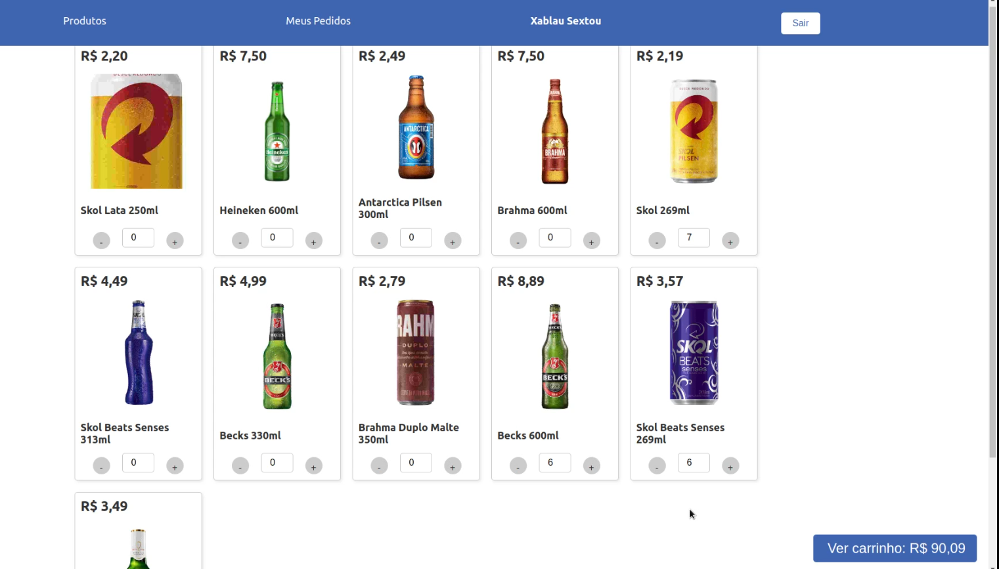
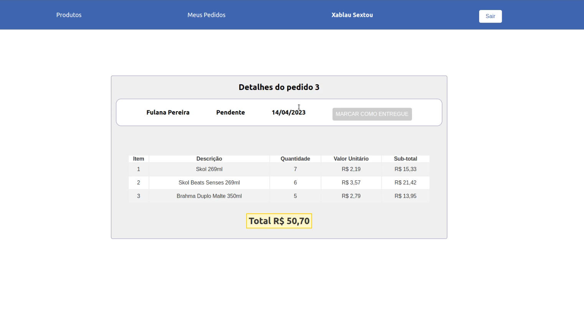
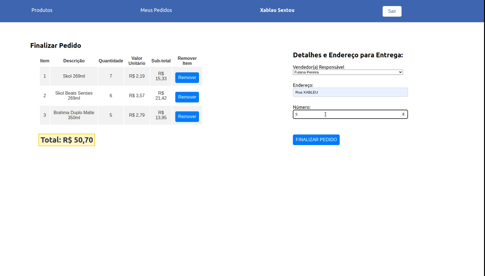
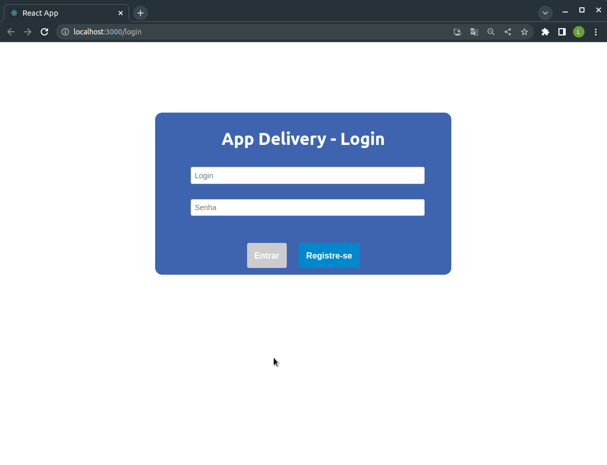
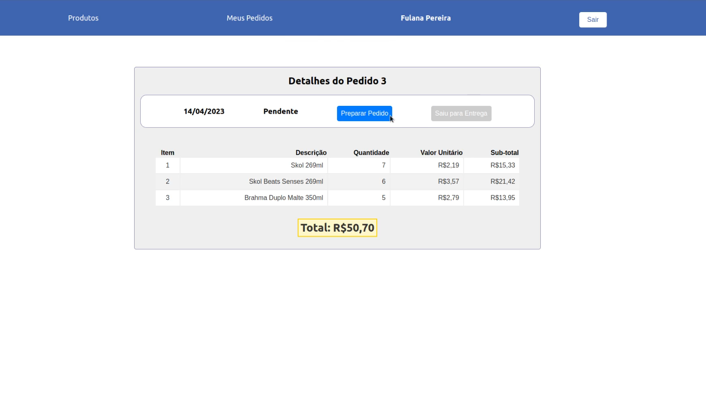

# App de Delivery  (Projeto Fullstack em grupo)

#### `Javascript | CSS | React | Hofs | ContexAPI | LocalStorage | Express | Sequelize | MySQL | Docker | Md5 | JWT`

## Como iniciar:
`(Você precisa ter o docker instalado)`<br> <br>
1º Clone o repositório
```bash
git clone git@github.com:lucas-g-oliveira/app-delivery.git
```
2º No diretório raiz da aplicação, execute o script abaixo para instalar as dependências, subir o db e iniciar a aplicação:
```bash
npm run start-app
```
#### Como interagir com o app: <br>
Você pode criar um novo usuário, ou usar o ```zebirita@email.com``` password: ```customer123``` já existente, para criar pedidos; e usar o login de seller: ```fulana@deliveryapp.com``` password: ```seller123``` para alterar o status de um pedido. No próximo tópico descrevo o que é possível fazer.


<br>

## Objetivo:
<section>
- Desenvolver o frontend e o backend de um sistema para gerênciar pedidos de um delivery de cervejas. O projeto tem o fluxo de pessoa cliente, onde é possível criar um novo usuário ou fazer login, e com o acesso validado, adicionar produtos ao carrinho, e efetuar checkout escolhendo a pessoa vendedora e prenchendo o endereço. Já no fluxo de pessoa vendedora, é possível alterar o status do pedido, para 'Preparando' ou 'Enviado', e a partir daí a pessoa cliente pode marcar o pedido como recebido.  
</section>

<br>

### Créditos:


Projeto desenvolvido em grupo; parte individual, parte em pair programing e parte refatorado por pessoa diferente á que programou a 1º versão, não sendo possível classificar com precisão o que desenvolvido por cada um. <br>
<br> <a href="https://www.linkedin.com/in/lucas-g-oliveira/"></a>
<br> <a href="https://www.linkedin.com/in/bruno-sayago/"></a>
<br> <a href="https://www.linkedin.com/in/gustavocorrealeal/"></a>
<br> <a href="https://www.linkedin.com/in/luizotcosta/"></a>
<br> <a href="https://www.linkedin.com/in/rodrigo-santiago-gomide/"></a>

- Desenvolvido pela Trybe: Conteúdos de testes, configurações do package.json, eslint, protótipo figma, e demais configurações base e de avaliação.

<br><br>
<br><br>
<br><br>
<br><br>
<br><br>

</br>
